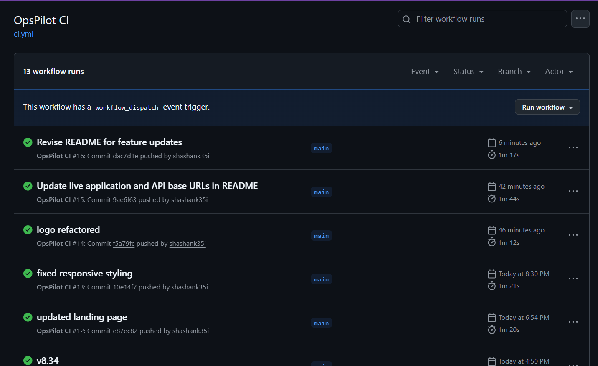
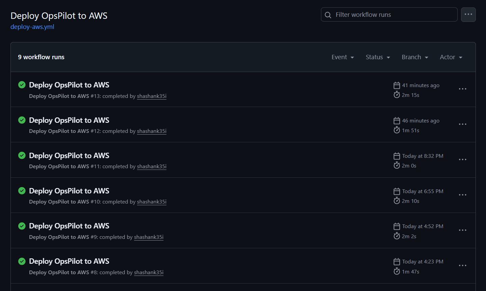
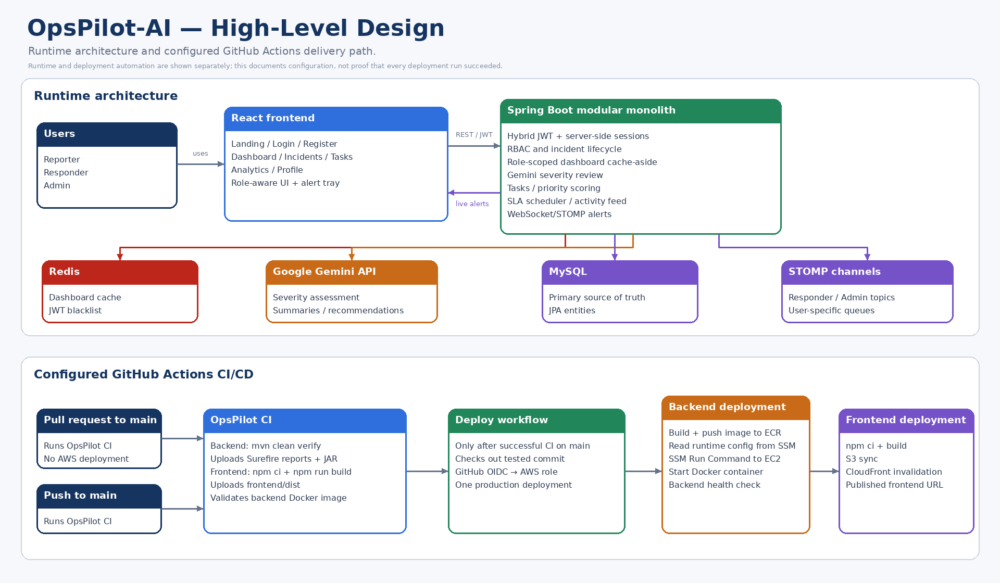
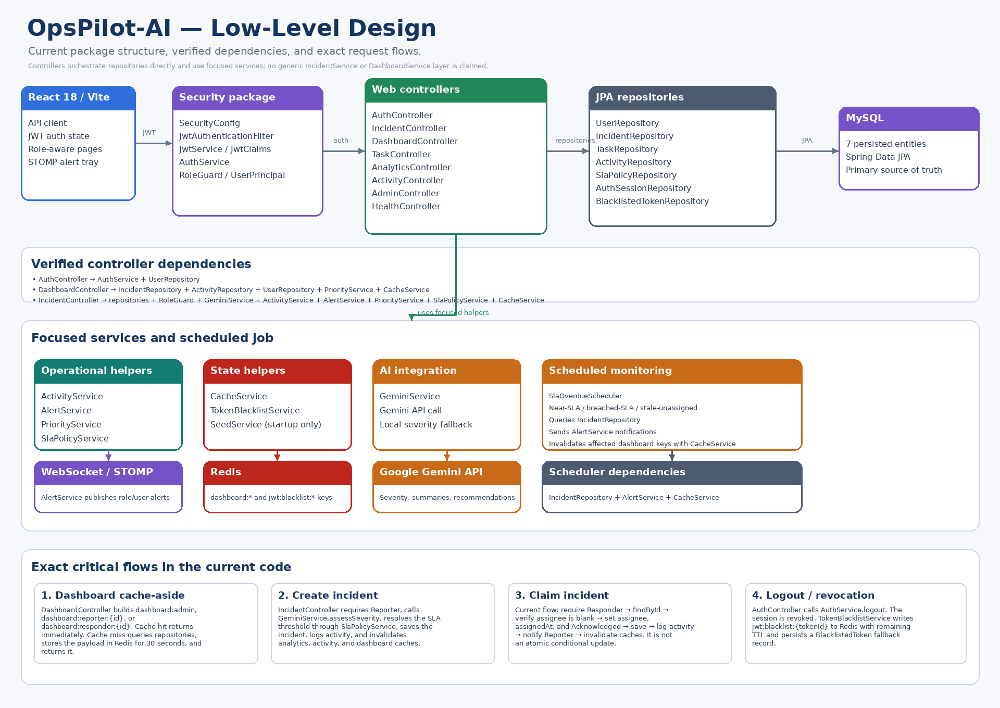
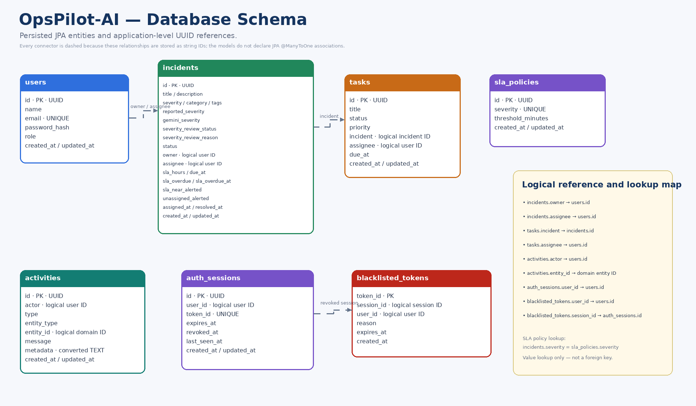
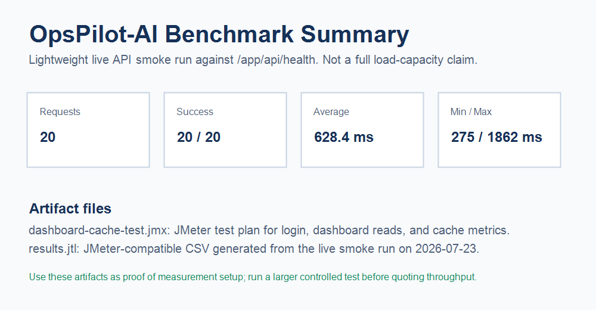

# OpsPilot-AI

<div align="center">

## Incident Response and Operations Platform

A full-stack incident-management system with role-based workflows, AI-assisted triage, SLA monitoring, Redis caching, real-time alerts, automated testing, and AWS deployment.

[](https://github.com/shashank35i/OpsPilot-AI/actions/workflows/ci.yml)
[](https://github.com/shashank35i/OpsPilot-AI/actions/workflows/deploy-aws.yml)
[](https://d231036zukeq44.cloudfront.net/app)
[](https://d231036zukeq44.cloudfront.net/app/api/health)


### [Open Live Application](https://d231036zukeq44.cloudfront.net/app) · [View GitHub Actions](https://github.com/shashank35i/OpsPilot-AI/actions) · [Import Postman Collection](docs/postman/OpsPilot.postman_collection.json)

</div>

---

## Engineering Proof

<table>
<tr>
<td width="50%" valign="top">

### Continuous Integration

GitHub Actions validates every pull request and push to `main`.

- Maven verification with JUnit/Mockito
- React production build
- Backend Docker image validation
- Test and build artifact upload

[](https://github.com/shashank35i/OpsPilot-AI/actions/workflows/ci.yml)

</td>
<td width="50%" valign="top">

### Continuous Deployment

After a successful CI run on `main`, GitHub Actions authenticates to AWS through OIDC.

- Pushes the backend image to Amazon ECR
- Deploys the Docker container to EC2 using SSM
- Publishes the frontend to S3
- Invalidates CloudFront
- Performs a backend health check

[](https://github.com/shashank35i/OpsPilot-AI/actions/workflows/deploy-aws.yml)

</td>
</tr>
</table>

> Workflow badges are the current source of truth. Screenshots provide visible execution evidence.

---

## Live Deployment

| Resource | URL |
|---|---|
| Application | [https://d231036zukeq44.cloudfront.net/app](https://d231036zukeq44.cloudfront.net/app) |
| API base | [https://d231036zukeq44.cloudfront.net/app/api/](https://d231036zukeq44.cloudfront.net/app/api/) |
| API health | [https://d231036zukeq44.cloudfront.net/app/api/health](https://d231036zukeq44.cloudfront.net/app/api/health) |
| Repository | [OpsPilot-AI](https://github.com/shashank35i/OpsPilot-AI) |

Use the seeded accounts below to explore Reporter, Responder, and Admin workflows.

---

## Demo


---

## Architecture at a Glance

<table>
<tr>
<td width="33%" align="center">

### High-Level Design

[](docs/architecture/opspilot-hld.png)

[Open full image](docs/architecture/opspilot-hld.png)

</td>
<td width="33%" align="center">

### Low-Level Design

[](docs/architecture/opspilot-lld.png)

[Open full image](docs/architecture/opspilot-lld.png)

</td>
<td width="33%" align="center">

### Database Schema

[](docs/architecture/opspilot-database-schema.png)

[Open full image](docs/architecture/opspilot-database-schema.png)

</td>
</tr>
</table>

```text
Users
  │
  ▼
React frontend on S3 + CloudFront
  │
  ├── HTTPS REST + JWT
  └── WebSocket / STOMP
  ▼
Spring Boot backend on EC2
  ├── MySQL on Amazon RDS
  ├── Redis dashboard cache
  ├── Redis JWT revocation blacklist
  ├── Google Gemini API
  └── Role-targeted STOMP alerts
```

---

## What OpsPilot Does

- Reporters create and track incidents.
- Responders claim, investigate, and resolve incidents.
- Admins manage assignments, severity reviews, and SLA policies.
- Gemini validates severity, generates summaries, and suggests troubleshooting steps.
- Redis serves repeated role-scoped dashboard requests.
- Redis also enables immediate JWT revocation on logout.
- Scheduled monitoring detects near-SLA, breached-SLA, and stale-unassigned incidents.
- WebSocket/STOMP delivers role-targeted operational alerts.
- Tasks, analytics, priority scoring, and activity records support execution and auditing.

---

## Core Engineering Features

### Authentication and Authorization

- JWT + DB session tracking with Redis token revocation
- Spring Security request filtering
- Reporter, Responder, and Admin authorization
- Redis-backed token revocation
- Persistent blacklist fallback records in MySQL
- Immediate token invalidation after logout

### Incident Management

- Incident creation and role-scoped retrieval
- Responder claiming and Admin assignment
- Status transitions and resolution
- Reporter-selected severity
- Gemini severity assessment
- Manual severity review
- SLA deadline calculation
- Priority scoring
- Activity logging

### Redis Cache-Aside

```text
dashboard:admin
dashboard:reporter:{userId}
dashboard:responder:{userId}
```

The backend checks Redis first. On a miss, it calculates the authorized dashboard result from MySQL, stores the payload in Redis, and returns it.

### SLA Monitoring

The scheduler detects:

- Incidents approaching the SLA deadline
- Incidents that have breached the SLA
- Incidents that remain unassigned beyond the configured threshold

Alert flags prevent duplicate notifications.

### Real-Time Alerts

```text
/ws
/topic/responders/alerts
/topic/admin/alerts
/queue/users/{userId}/alerts
```

### Gemini Integration

- Severity assessment
- Incident summaries
- Troubleshooting recommendations
- Remediation-task suggestions

AI supports the workflow; human review remains authoritative for mismatches.

---

## Tech Stack

| Layer | Technologies |
|---|---|
| Frontend | React 18, Vite, JavaScript, React Router, Lucide Icons |
| Backend | Java 17, Spring Boot, Spring Security, Spring Data JPA, Bean Validation |
| Database | MySQL, Amazon RDS |
| Cache and revocation | Redis, Spring Data Redis |
| Realtime | WebSocket, STOMP |
| AI | Google Gemini API |
| Testing | JUnit 5, Mockito, Maven Surefire |
| Load testing | Apache JMeter |
| API testing | Postman |
| Containerization | Docker, Docker Compose |
| CI/CD | GitHub Actions, GitHub OIDC |
| AWS | EC2, ECR, RDS, S3, CloudFront, SSM Parameter Store, SSM Run Command |

---

## Repository Structure

```text
OpsPilot-AI/
├── .github/workflows/
│   ├── ci.yml
│   └── deploy-aws.yml
├── backend/
├── frontend/
├── docs/
│   ├── architecture/
│   │   ├── opspilot-hld.png
│   │   ├── opspilot-lld.png
│   │   └── opspilot-database-schema.png
│   ├── cicd/
│   │   ├── ci-success.png
│   │   └── aws-deployment-success.png
│   ├── api/API.md
│   ├── postman/
│   │   ├── OpsPilot.postman_collection.json
│   │   └── OpsPilot-Local.postman_environment.json
│   ├── benchmarks/
│   │   ├── dashboard-cache-test.jmx
│   │   ├── results.jtl
│   │   ├── summary-report.png
│   │   └── README.md
│   └── decisions/DESIGN_DECISIONS.md
├── demos/opspilot_demo.gif
├── docker-compose.yml
├── README.md
└── LICENSE
```

---

## Quick Start

### Prerequisite

- Docker Desktop

### Run the complete application

```bash
docker compose up --build
```

| Service | URL |
|---|---|
| Frontend | `http://localhost:5173` |
| Backend health | `http://localhost:8080/api/health` |

```bash
docker compose down
```

Remove persistent volumes:

```bash
docker compose down -v
```

---

## Local Development

### Backend

```bash
cd backend
cp .env.example .env
mvn spring-boot:run
```

### Frontend

```bash
cd frontend
cp .env.example .env
npm install
npm run dev
```

---

## Demo Accounts

Available when `SEED_ON_START=1`.

| Role | Email | Password |
|---|---|---|
| Reporter | `reporter@opspilot.ai` | `Reporter@123` |
| Responder | `responder@opspilot.ai` | `Responder@123` |
| Admin | `admin@opspilot.ai` | `Admin@123` |

> Demo credentials only. Production accounts must use different passwords and controlled provisioning.

---

## Environment Variables

### Backend

| Variable | Required | Local example |
|---|---:|---|
| `PORT` | Yes | `8080` |
| `DATABASE_URL` | Yes | `jdbc:mysql://localhost:3306/opspilot?createDatabaseIfNotExist=true&useSSL=false&allowPublicKeyRetrieval=true&serverTimezone=UTC` |
| `DATABASE_USERNAME` | Yes | `opspilot` |
| `DATABASE_PASSWORD` | Yes | `opspilot` |
| `JPA_DDL_AUTO` | No | `update` |
| `REDIS_URL` | No | `redis://localhost:6379` |
| `CLIENT_ORIGIN` | Yes | `http://localhost:5173` |
| `JWT_SECRET` | Yes | `replace_with_a_long_random_secret` |
| `JWT_TTL_HOURS` | No | `8` |
| `SEED_ON_START` | No | `1` |
| `APP_VERSION` | No | `1.0.0` |
| `SLA_OVERDUE_SCHEDULER_ENABLED` | No | `true` |
| `SLA_OVERDUE_SCHEDULER_DELAY_MS` | No | `60000` |
| `SLA_OVERDUE_BATCH_SIZE` | No | `100` |
| `SLA_NEAR_THRESHOLD_PERCENT` | No | `80` |
| `UNASSIGNED_ALERT_MINUTES` | No | `15` |
| `GEMINI_API_KEY` | No | `your_key` |
| `GEMINI_MODEL` | No | `gemini-1.5-flash` |

### Frontend

| Variable | Required | Local example |
|---|---:|---|
| `VITE_API_BASE_URL` | Yes | `http://localhost:8080` |

### Secret Management

No real credentials are committed. Production runtime values are supplied through AWS SSM Parameter Store or runtime environment variables. GitHub Actions uses OIDC instead of permanent AWS access keys.

Ignored local files include:

```text
.env
application-local.properties
application-production-private.properties
```

---

## API Documentation

For authentication, roles, request bodies, responses, and errors:

### [Open API Documentation](docs/api/API.md)

| Area | Method | Endpoint |
|---|---|---|
| Authentication | `POST` | `/api/auth/register` |
| Authentication | `POST` | `/api/auth/login` |
| Authentication | `POST` | `/api/auth/logout` |
| Authentication | `GET` | `/api/auth/me` |
| Dashboard | `GET` | `/api/dashboard` |
| Incidents | `GET` | `/api/incidents` |
| Incidents | `POST` | `/api/incidents` |
| Incidents | `PATCH` | `/api/incidents/{id}` |
| Incidents | `POST` | `/api/incidents/{id}/claim` |
| Incidents | `POST` | `/api/incidents/{id}/review-severity` |
| Incidents | `POST` | `/api/incidents/{id}/resolve` |
| Incidents | `POST` | `/api/incidents/{id}/auto-tasks` |
| AI | `POST` | `/api/ai/incident-summary` |
| Tasks | `GET` | `/api/tasks` |
| Tasks | `POST` | `/api/tasks` |
| Tasks | `PATCH` | `/api/tasks/{id}` |
| Admin | `GET` | `/api/admin/sla-policies` |
| Admin | `PUT` | `/api/admin/sla-policies` |
| Analytics | `GET` | `/api/analytics/summary` |
| Analytics | `GET` | `/api/analytics/cache-metrics` |
| Metadata | `GET` | `/api/models/priority` |
| Activity | `GET` | `/api/activities` |
| Health | `GET` | `/api/health` |

---

## Postman Collection

- [OpsPilot API collection](docs/postman/OpsPilot.postman_collection.json)
- [OpsPilot local environment](docs/postman/OpsPilot-Local.postman_environment.json)

The collection covers authentication, dashboard, incident lifecycle, tasks, analytics, activity feed, SLA policies, and logout.

---

## JUnit and Mockito Tests

The backend includes focused tests for:

- Redis dashboard-prefix invalidation
- Gemini local severity fallback
- SLA-policy defaults and validation
- Near-SLA and stale-unassigned scheduler behavior
- Role-targeted cache invalidation
- JWT blacklist persistence fallback
- Redis-unavailable blacklist checks
- Reporter, Responder, and Admin authorization rules

Run:

```bash
cd backend
mvn clean verify
```

GitHub Actions uploads Maven Surefire reports for each CI run.

---

## Load Testing

Artifacts:

- [JMeter test plan](docs/benchmarks/dashboard-cache-test.jmx)
- [Raw results](docs/benchmarks/results.jtl)
- [Methodology and findings](docs/benchmarks/README.md)



JMeter measures request count, latency, throughput, and errors. Backend metrics measure Redis hits, misses, MySQL dashboard aggregations, and estimated repeated database-read reduction.

No performance number should be quoted without the matching test plan, environment, and raw result file.

---

## Database Model

| Entity | Purpose |
|---|---|
| `users` | User identity, password hash, and role |
| `incidents` | Incident lifecycle, ownership, assignment, severity, SLA, and alert state |
| `tasks` | Remediation tasks associated with incidents |
| `activities` | Operational audit and activity records |
| `sla_policies` | Severity-based SLA thresholds |
| `auth_sessions` | Server-side sessions and JWT identifiers |
| `blacklisted_tokens` | Persisted revoked-token fallback records |

Logical references are stored as UUID strings rather than JPA `@ManyToOne` associations.

SLA policies use a value lookup:

```text
incidents.severity = sla_policies.severity
```

This is not a database foreign key.

---

## Design Decisions

### [Open Design Decisions](docs/decisions/DESIGN_DECISIONS.md)

| Decision | Reason |
|---|---|
| Modular Spring Boot backend | Simple deployment with clear modules |
| MySQL source of truth | Durable transactional workflow data |
| Redis cache-aside | Reduces repeated dashboard aggregation |
| Role-scoped cache keys | Prevents cross-user data leakage |
| Redis JWT blacklist | Immediate logout while retaining JWT authentication |
| Persistent blacklist fallback | Supports revocation checks when Redis is unavailable |
| Gemini as advisory support | AI assists without replacing human control |
| Scheduled SLA monitoring | Runs even when no user is active |
| WebSocket/STOMP alerts | Delivers immediate operational notifications |
| GitHub OIDC | Avoids permanent AWS keys |
| EC2 + Docker | Reproducible backend deployment |
| S3 + CloudFront | Efficient static frontend delivery |

---

## CI/CD Pipeline

### Pull Request

```text
Pull request to main
        │
        ▼
OpsPilot CI
        ├── Maven verification
        ├── JUnit / Mockito
        ├── React production build
        └── Docker image validation
```

A pull request does not deploy to AWS.

### Push to `main`

```text
Push to main
      │
      ▼
OpsPilot CI succeeds
      │
      ▼
Deploy workflow
      ├── GitHub OIDC authentication
      ├── ECR image push
      ├── SSM configuration retrieval
      ├── EC2 Docker deployment
      ├── S3 frontend sync
      ├── CloudFront invalidation
      └── Health verification
```

---

## AWS Deployment

| Component | AWS service |
|---|---|
| Frontend assets | Amazon S3 |
| Frontend CDN | Amazon CloudFront |
| Backend runtime | Amazon EC2 |
| Backend image | Amazon ECR |
| Database | Amazon RDS for MySQL |
| Runtime configuration | AWS Systems Manager Parameter Store |
| Remote deployment command | AWS Systems Manager Run Command |
| GitHub authentication | GitHub Actions OIDC |

---

## Known Limitations

- Incident claiming uses a read-check-update-save flow instead of an atomic conditional update.
- The application is a modular monolith without a distributed message broker.
- WebSocket/STOMP fan-out targets the current single-backend deployment.
- API documentation is Markdown-based rather than generated OpenAPI.
- Logical references are stored as UUID strings rather than JPA associations.
- Public registration creates Reporter accounts only.
- Benchmark results depend on the committed test environment.

---

## Future Improvements

- Replace incident claiming with an atomic conditional update or optimistic locking
- Add Swagger/OpenAPI
- Add Testcontainers-based MySQL and Redis integration tests
- Add distributed STOMP fan-out
- Add notification preferences
- Add an incident detail timeline and comments
- Add managed Responder/Admin provisioning
- Add targeted cache invalidation
- Add production observability
- Add controlled benchmark runs to CI

---

## Troubleshooting

### MySQL connection failure

Verify:

```text
DATABASE_URL
DATABASE_USERNAME
DATABASE_PASSWORD
```

### Redis unavailable

Dashboard reads fall back to MySQL. Revocation checks use the persistent fallback where supported.

### CORS error

Ensure `CLIENT_ORIGIN` exactly matches the frontend origin.

### MySQL not ready in Docker

Wait for the health check, then restart the backend service.

### Node.js warning

Use Node.js 20.19+ or 22.12+.

---

## Developer

Built by **Shashank Preetham**.

- GitHub: [shashank35i](https://github.com/shashank35i)
- Project: [OpsPilot-AI](https://github.com/shashank35i/OpsPilot-AI)

---

## License

This project is licensed under the [MIT License](LICENSE).
