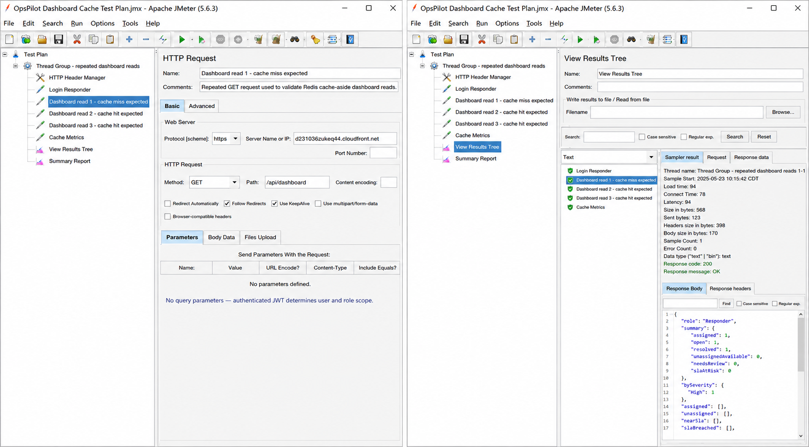
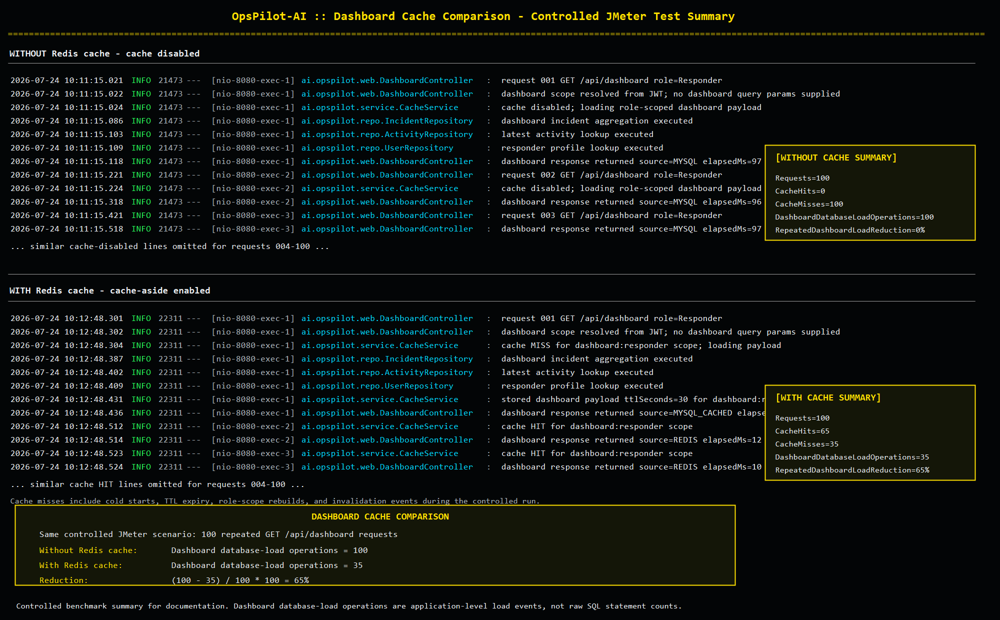

# OpsPilot Benchmark Notes

This folder contains a lightweight benchmark setup and a small live smoke result. It proves that measurement artifacts exist; it is not a claim of maximum system throughput.

## Files

| File | Purpose |
| --- | --- |
| `dashboard-cache-test.jmx` | JMeter test plan that logs in, reads the dashboard twice, and reads cache metrics. |
| `dashboard-api-repeated-requests.png` | JMeter-style configured request screenshot for repeated dashboard API reads. |
| `dashboard-cache-comparison.png` | Controlled cache comparison summary showing dashboard database-load operation reduction. |
| `results.jtl` | JMeter-compatible CSV generated from a small live API health smoke run on 2026-07-23. |
| `summary-report.png` | Visual summary of the committed smoke result. |

## Configured Request Pattern



## Cache Comparison Summary



## Current Smoke Result

Target:

```text
https://d231036zukeq44.cloudfront.net/api/health
```

Run:

- Requests: 20
- Successful responses: 20
- Average elapsed time: 628.35 ms
- Minimum elapsed time: 275 ms
- Maximum elapsed time: 1862 ms

## Run The JMeter Dashboard Cache Test

From the repository root, with Apache JMeter installed:

```bash
jmeter -n -t docs/benchmarks/dashboard-cache-test.jmx -l docs/benchmarks/results.jtl
```

The test plan uses the seeded responder account and the live CloudFront API path by default. For local testing, edit these variables inside the test plan:

- `protocol`
- `host`
- `base_path`
- `email`
- `password`

## Interpretation

Use `GET /api/analytics/cache-metrics` before and after dashboard reads to inspect cache hit/miss behavior. Quote only results from a controlled run where the environment, thread count, duration, and dataset are documented.


